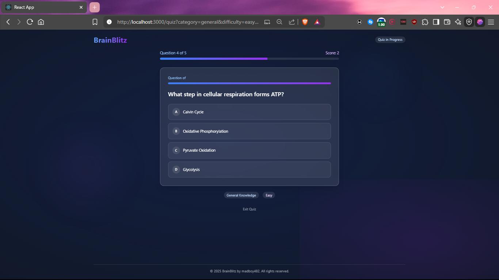
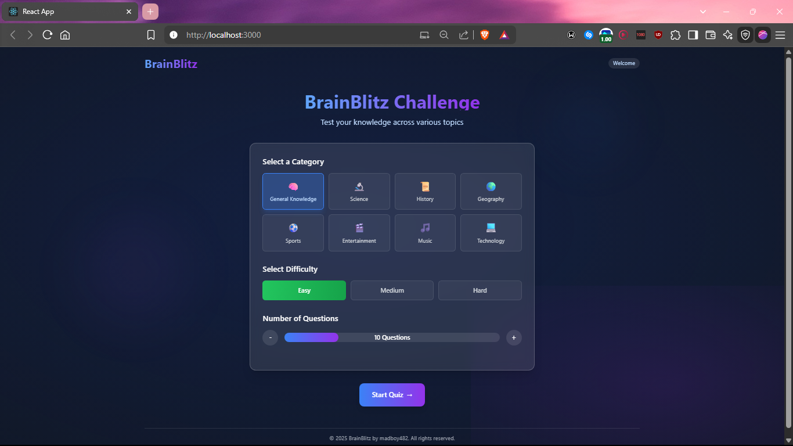
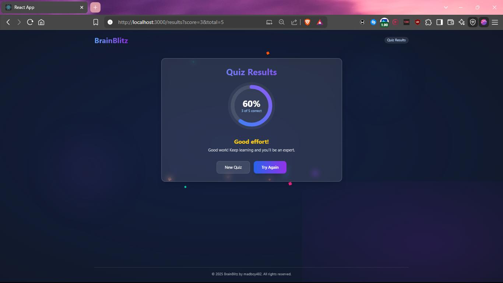

# 🧠 BrainBlitz

> A modern trivia application that challenges your knowledge and expands your mind.



## 📚 About

BrainBlitz transforms the traditional quiz experience into an engaging journey of discovery. With questions spanning numerous categories and difficulty levels, it provides both casual entertainment and serious knowledge testing.

Built with modern web technologies, BrainBlitz delivers a responsive, accessible, and visually appealing experience across all devices. The clean interface keeps the focus on what matters most—answering questions and having fun while learning.

## ✨ Key Features

- 🌐 **Diverse Knowledge Categories** — From history and science to entertainment and sports
- 🔥 **Adaptive Difficulty Levels** — Challenge yourself with increasingly complex questions
- ⚙️ **Customizable Experience** — Choose the number of questions to fit your schedule
- 🎯 **Visual Feedback** — Immediate responses to your answers with color-coded indicators
- ✅ **Persistent Positioning** — Answer options stay in place for distraction-free selection
- 📊 **Progress Tracking** — Monitor your score as you advance through questions
- 📱 **Mobile-First Design** — Enjoy the full experience on any device
- 🎭 **Elegant Animations** — Smooth transitions enhance the quiz experience

## 📸 Screenshots

<div align="center">
  
  <p><em>🏠 Customize your quiz experience with intuitive category and difficulty selectors</em></p>
  
  <br>
  
  
  <p><em>❓ Focus on answering questions with our distraction-free interface</em></p>
  
  <br>
  
  
  <p><em>🏆 Get immediate feedback on your performance with detailed results</em></p>
</div>

## 🛠️ Technologies

BrainBlitz leverages a powerful stack of modern web technologies:

- ⚛️ **React** — Component-based UI architecture
- 🔀 **React Router** — Seamless navigation between quiz screens
- 🎨 **Tailwind CSS** — Utility-first styling with minimal overhead
- 🌟 **Framer Motion** — Physics-based animations for a polished feel
- 🧩 **Open Trivia Database API** — Extensive collection of verified questions

## 🚀 User Experience

BrainBlitz was designed with the user journey in mind:

1. 🎮 **Select Your Challenge** — Choose your preferred category, difficulty, and question count
2. 🤔 **Test Your Knowledge** — Answer questions with a clean, intuitive interface
3. 📝 **Review Your Results** — See your final score and areas for improvement
4. 🔄 **Try Again** — Challenge yourself to beat your previous score

## 🏁 Getting Started

### Prerequisites

- Node.js (v14.0 or higher)
- npm or yarn

### Installation

```bash
# Clone the repository
git clone https://github.com/madboy482/BrainBlitz.git

# Navigate to the project directory
cd BrainBlitz

# Install dependencies
npm install
# or
yarn install

# Start the development server
npm start
# or
yarn start
```

Visit `http://localhost:3000` to start your quiz adventure! 🎉

## 💻 Development

BrainBlitz follows modern React development practices:

- 🧩 Functional components with hooks
- 🔄 Custom hook (useQuiz) for quiz state management
- 📱 Responsive design principles
- ♿ Accessible UI elements
- 📦 Modular component structure

## 🔮 Future Roadmap

We're constantly working to improve BrainBlitz with new features:

- ⏱️ **Time Challenge Mode** — Race against the clock to answer questions
- 👤 **Personalized Accounts** — Save your progress and track improvement
- 🏅 **Competitive Leaderboards** — Compare your knowledge with others
- ✏️ **Question Creation** — Contribute your own questions to the platform
- 📵 **Offline Support** — Play without an internet connection
- 🌓 **Theme Customization** — Choose between light and dark modes

## 👥 Contributing

Contributions are welcome and appreciated! Here's how you can help:

1. Fork the repository
2. Create your feature branch (`git checkout -b amazing-feature`)
3. Commit your changes (`git commit -m 'Add some amazing feature'`)
4. Push to the branch (`git push origin amazing-feature`)
5. Open a Pull Request

## 📜 License

This project is open-source and available under the **MIT License**.  
See the full license details [here](./LICENSE).

---

<div align="center">
  <p>
    Made with ❤️ by <a href="https://github.com/madboy482">madboy482</a>
  </p>
  <p>
    © 2025 BrainBlitz by madboy482 — Expand your mind, one question at a time. ✨
  </p>
</div>
